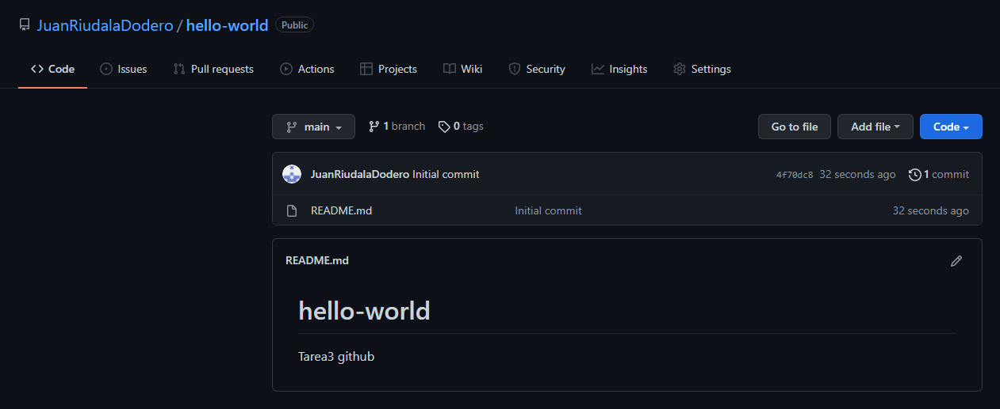
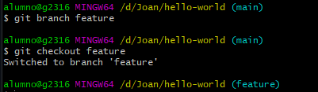
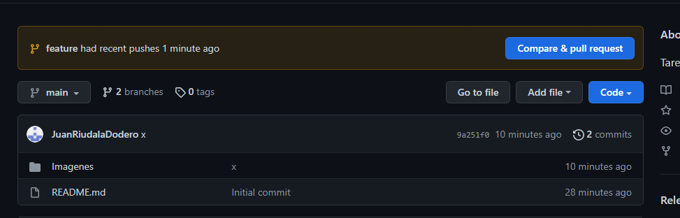
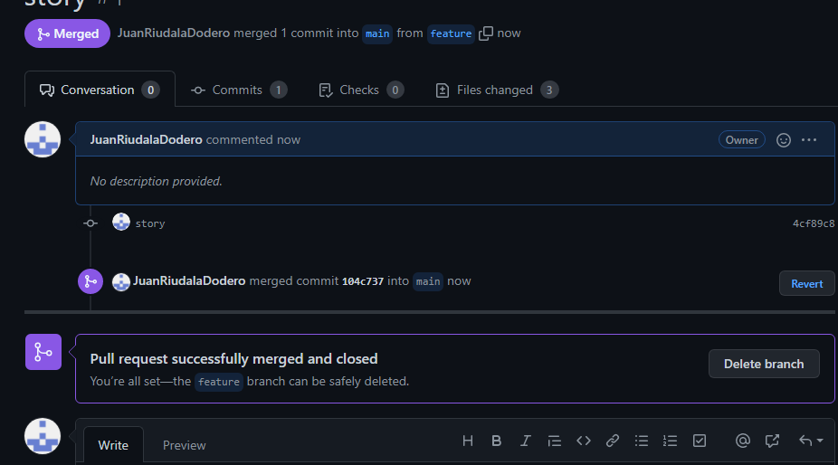
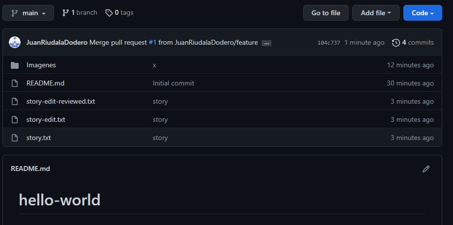
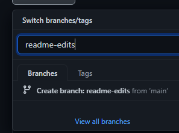

# Tarea 3 GitHub // Hello-World

 - Iniciamos sesion en GitHub.
 - Le damos al mas de la esquinita susperior y selecionamos new repositori.
 - Le inicamos que cuando se cree contenga un README.MD
 - La seleccionamos en publica.
 - Creamos el repositorio.
 

  

 - Creamos una rama llamada features mediante git branch features.
 - Nos situamos en ella mediante git checkout features.

 

 - Una vez situado en la rama creamos mediante el comando touch 3 archivos, story.txt story-edit.txt story-edit-reviwed.txt .
 - Hacemos un git add y los nombres de los 3 archivos.
 - Seguidos de un git commit -m "un comentario" y los nombres de los archivos.
 - Un git push para subir los cambios.
 - Una vez hecho el git push nos salgra un mensaje en github, entrariamos a la notificacion. 

 

 - Saldra una pagina para comprobar y aplicar cambios, le damos a commit, nos saldia el siguiente pagina lo que seleccionarios delete branch para borrar la rama que hemos creado para añadir archivos.

 

- Esto seria el main con los cambios aplicados.

 

- Creamos otra rama llamada readme-edits pero esta vez desde la pagina.

 

- Hacemos clik donde pone create bracnch:"el nombre" from main, esto creara una rama clon de main. 
- Desde la pagina nos situriamos en la neva rama para editar el readme.
- Editamos el readme(el proceso actual)
- Una vez hayamos acabado el readme repetiriamos los pasos de comit, marge y delete branch.
